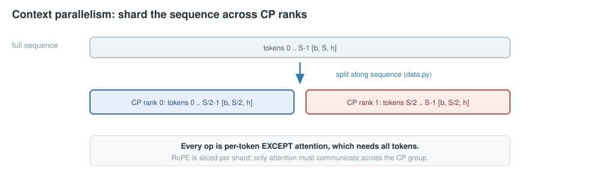
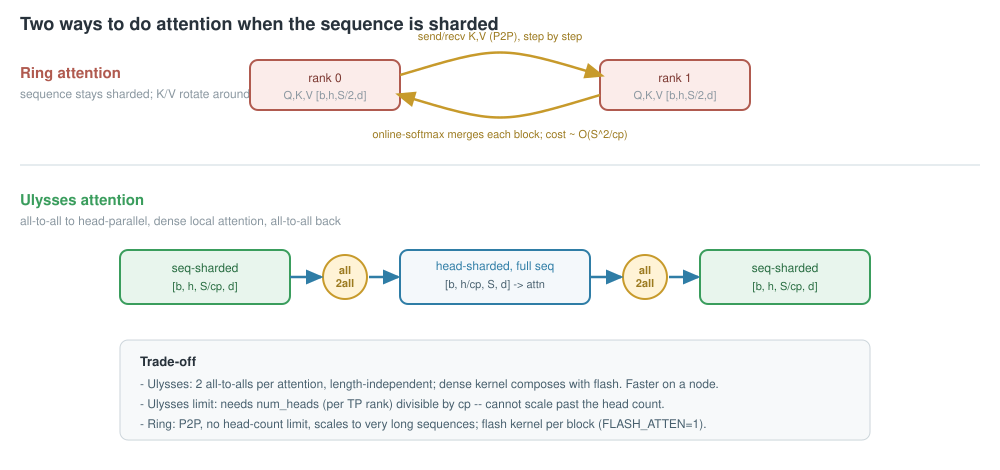

<!-- _class: lead -->

# Context Parallelism, from scratch
## Sharding the sequence in `picotron`

ring attention (already shipping) -> **DeepSpeed-Ulysses** layered alongside it

<span class="muted">bit-exact with a single-GPU reference, gradient-validated and benchmarked on 2x A100</span>

---

## What we are parallelizing

TP shards the hidden dim, SP shards the norm/residual regions, but the **attention score matrix is still
`O(S^2)` per head**. Past some sequence length, one GPU cannot hold the activations.

Context parallelism shards the **sequence itself** across a dedicated grid axis (`cp`): each rank holds
`S/cp` tokens.

- a real axis in `DP x PP x CP x EP x TP`, with its **own process group** (`cp_group`)
- every op is per-token... **except attention**, where token `i` attends to tokens on other ranks

<span class="muted">picotron shards the sequence contiguously in `data.py`; RoPE is sliced per shard.</span>

---

## The setup: sequence sharded across CP



The whole problem reduces to one question: **how do we run attention when no rank has the full sequence?** Two answers follow.

---

## Two answers



---

## Ring attention (`CP_ATTENTION=ring`, default)

Keep Q/K/V sharded `[b, h, S/cp, d]`. Walk the CP ring `cp` times:

1. compute attention of local Q vs the K/V block currently held
2. P2P-send K/V to the next rank, receive the next block
3. an **online softmax** merges per-block outputs -- never materialize `S x S`

<div class="cols"><div>

**Strengths**
- P2P only; no all-to-all
- **no head-count limit**
- scales to very long seq / multi-node

</div><div>

**Costs**
- attention done in `cp` blocked steps
- online-softmax bookkeeping
- per-step P2P (vs Ulysses' 2 all-to-alls)
- flash kernel per block (`FLASH_ATTEN=1`); python ref otherwise

</div></div>

---

## Ulysses attention (`CP_ATTENTION=ulysses`)

Don't move K/V -- move the **layout**. Two all-to-alls bracket an ordinary attention:

```
in   [b, num_heads,    S/cp, d]    sequence sharded
a2a  [b, num_heads/cp, S,    d]    head sharded, full seq   (scatter heads, gather seq)
attn standard dense / flash attention, this rank's heads, full sequence
a2a  [b, num_heads,    S/cp, d]    back to sequence sharded (scatter seq, gather heads)
```

Same elements reshuffled (`num_heads/cp * S == num_heads * S/cp`) -> per-rank size unchanged. The
attention is a **normal kernel**: composes with flash, no online softmax. Comm = 2 all-to-alls,
**independent of sequence length**.

---

## The backward is the same collective

An all-to-all's transpose is another all-to-all with scatter/gather dims swapped -- one tiny autograd
function covers both directions:

```python
class _SeqAllToAll(torch.autograd.Function):
    @staticmethod
    def forward(ctx, group, x, scatter_dim, gather_dim):
        ctx.scatter_dim, ctx.gather_dim, ctx.group = scatter_dim, gather_dim, group
        return _all_to_all(x, scatter_dim, gather_dim, group)

    @staticmethod
    def backward(ctx, grad):
        return (None, _all_to_all(grad, ctx.gather_dim, ctx.scatter_dim, ctx.group), None, None)
```

**The limit:** `num_heads` (per TP rank) must be divisible by `cp` -- Ulysses cannot scale CP past the
head count. GQA is expanded upstream, so K/V head count is never the constraint.

---

## Correctness (bit-exact)

```bash
CUDA_DEVICE_MAX_CONNECTIONS=1 torchrun --nproc_per_node 2 tests/test_cp_ulysses.py
```

Full-sequence single-GPU reference vs sequence-sharded Ulysses. Every param is replicated and each rank
sees one token shard, so gradients are partial sums -> sum over the CP group recovers the reference.

| check (fp32, SDPA, cp=2) | result |
| --- | --- |
| forward logits vs reference | `max_diff = 4.8e-7` |
| loss (CP-summed) vs reference | `diff = 1.5e-5` |
| gradients (CP-summed) vs reference | `max_diff = 7.2e-7` |

---

## Benchmark (2x A100, bf16, cp=2, flash in both)

| seq (per rank) | attention | ms/step | tok/s | peak MB | speedup |
| --- | --- | --- | --- | --- | --- |
| 4k (2k/rank) | ring | 48.6 | 84,301 | 2,593 | 1.00x |
| 4k (2k/rank) | **ulysses** | **35.0** | **117,010** | 2,627 | **1.39x** |
| 8k (4k/rank) | ring | 77.3 | 105,922 | 4,364 | 1.00x |
| 8k (4k/rank) | **ulysses** | **62.2** | **131,802** | 4,431 | **1.24x** |
| 16k (8k/rank) | ring | 167.9 | 97,577 | 7,905 | 1.00x |
| 16k (8k/rank) | **ulysses** | **135.6** | **120,828** | 8,039 | **1.24x** |

<span class="small muted">Now flash-vs-flash: the earlier ~2.8x (python ring vs flash Ulysses) was an implementation artifact. The real algorithmic gap at cp=2 is ~1.2-1.4x -- Ulysses does one dense flash + 2 all-to-alls; ring does `cp` flash calls + per-step P2P, with non-zigzag causal load imbalance. Memory is now ~equal.</span>

<span class="small muted">**`--compile`:** `torch.compile` is a modest ~3-8% win (a bit more for ring) and ~5% less peak; it does *not* change the ranking -- Ulysses keeps its ~1.2-1.4x lead. Compile only fuses the dense regions (linear/norm/rotary/MLP); the collectives + flash stay opaque. (Gotcha: the `CP_ATTENTION` env switch is constant-folded without a dynamo guard, so timing both in one process makes the 2nd reuse the 1st's graph -- `bench_cp.py` now `torch._dynamo.reset()`s per config.)</span>

---

## Scaling to very long seq (cp=2)

| seq | ring ms | uly ms | speedup | ring MB | uly MB |
| --- | --- | --- | --- | --- | --- |
| 16k | 166.6 | 135.7 | 1.23x | 7,905 | 8,039 |
| 32k | 441.7 | 343.8 | 1.28x | 14,987 | 15,256 |
| 64k | 1341.4 | 1003.2 | 1.34x | 29,152 | 29,689 |
| 128k | 4568.0 | 3310.3 | 1.38x | 57,482 | 58,556 |
| 256k | OOM | OOM | -- | -- | -- |

<div class="cols"><div>

**Ulysses' lead *grows* with seq** (1.23x -> 1.38x), it doesn't shrink. Fixed small `cp`: the `O(S^2)` term dominates and ring's causal load imbalance (rank 1 does 2 blocks) costs more; Ulysses runs one balanced dense flash.

</div><div>

**Ring's mem edge is real but tiny** (~2%, the Ulysses all-to-all transient) -- both OOM at ~256k. So at cp=2 single node there's **no seq where ring wins**. Ring's regime (`cp > num_heads`, multi-node) needs >2 GPUs to show.

</div></div>

---

## How to choose

| Situation | Use |
| --- | --- |
| Single node, `cp <= num_heads`, want speed | **`CP_ATTENTION=ulysses`** |
| `cp > num_heads`, extreme seq, multi-node | `CP_ATTENTION=ring` (default) |

```bash
CP_ATTENTION=ulysses CUDA_DEVICE_MAX_CONNECTIONS=1 \
    torchrun --nproc_per_node 8 train.py --config cfg.yaml
```

- Ulysses: kernel-friendly, length-independent comm, capped at the head count
- Ring: P2P, no cap, the long-context / large-CP workhorse

---

## File map & how to run

| File | Role |
| --- | --- |
| `context_parallel.py` | ring attention: flash kernel (`FLASH_ATTEN=1`) or python ref + online softmax |
| `ulysses.py` | all-to-all head redistribution + local attention |
| `cp_communications.py` | the ring P2P send/recv primitive |
| `tests/test_cp_ulysses.py` | Ulysses vs single-GPU reference (bit-exact, fp32) |
| `tests/test_cp_ring_flash.py` | flash ring vs single-GPU flash reference (bf16) |
| `tests/bench_cp.py` | ring vs Ulysses: step time / tok/s / peak memory |

```bash
CUDA_DEVICE_MAX_CONNECTIONS=1 torchrun --nproc_per_node 2 tests/test_cp_ulysses.py
CUDA_DEVICE_MAX_CONNECTIONS=1 torchrun --nproc_per_node 2 tests/test_cp_ring_flash.py
CUDA_DEVICE_MAX_CONNECTIONS=1 FLASH_ATTEN=1 torchrun --nproc_per_node 2 tests/bench_cp.py \
    --heads 16 --seq 8192 --hidden 2048 --inter 8192 --layers 4
```

---

<!-- _class: lead -->

# Recap

**Context parallelism = shard the sequence.** Only attention needs to talk across ranks.

- **Ring**: rotate K/V, online softmax -- no head-count limit, scales far
- **Ulysses**: all-to-all to head-parallel, dense attention -- fast & kernel-friendly, capped at `num_heads`

<span class="muted">one switch, same CP group: `CP_ATTENTION=ring | ulysses`</span>
