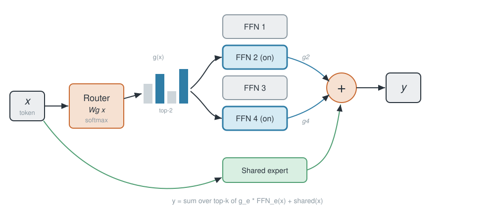
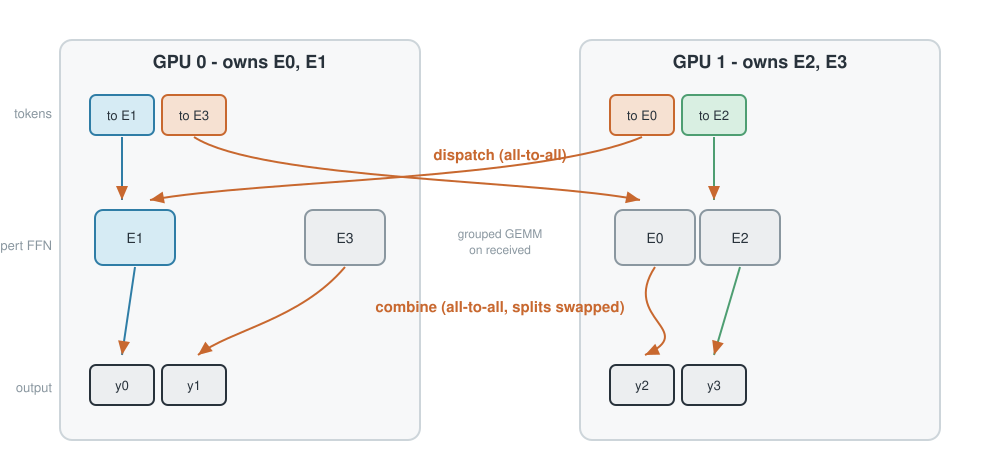
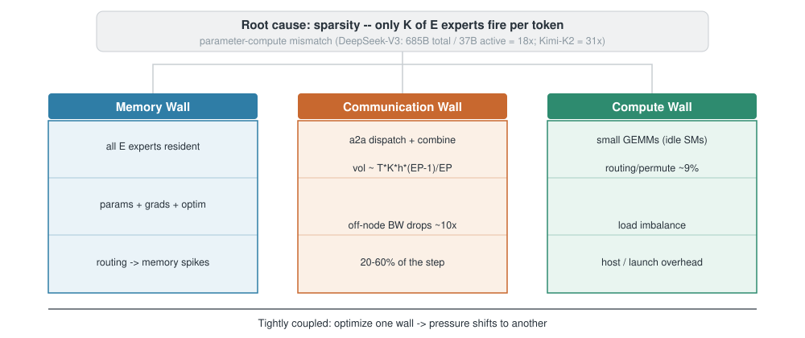
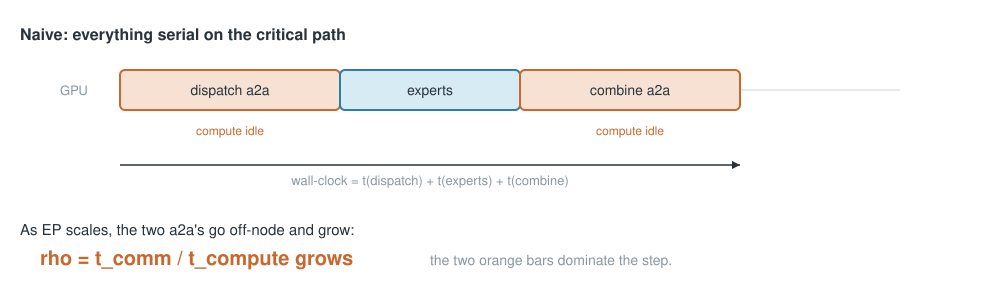
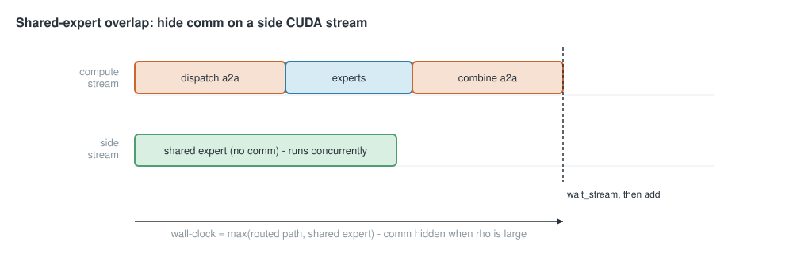
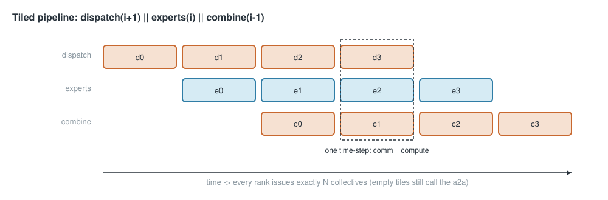
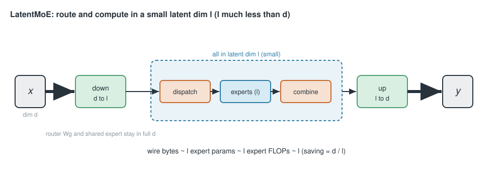
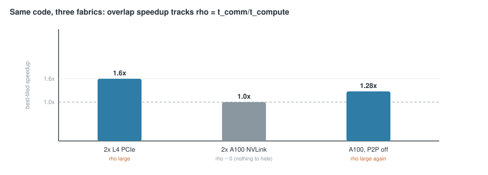
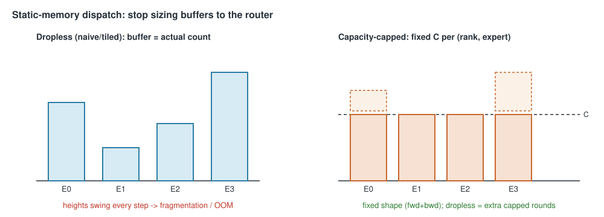

<!-- _class: lead -->

# Expert Parallelism, from scratch
## A custom `expert_parallel` module I built on top of `picotron`

From a naive all-to-all to DeepEP, tiled pipelines, FP8, LatentMoE — and what it takes to actually *train* at scale

<span class="muted">extending picotron (DP·PP·CP·TP) with a 5th axis — expert parallelism — and a stack of MoE comm optimizations</span>
<span class="muted">deep dive: autograd · CUDA streams · Triton kernels · the bandwidth lesson</span>

---

## What we are optimizing

A **Mixture-of-Experts** FFN: a router picks the top-`k` of `E` experts per token.

$$ y_t = \sum_{e \in \text{top-}k(t)} g_{t,e}\, \mathrm{FFN}_e(x_t) \;+\; \mathrm{shared}(x_t), \qquad g_{t,e} = \mathrm{softmax}(W_g x_t)_e $$



<span class="muted">Only `k` of `E` experts run per token (sparse). The router is trained; the shared expert is always on.</span>

---

## EP: tokens travel to their expert and back

**Expert Parallelism:** shard the `E` experts across ranks — rank `r` owns `[r·L, (r+1)·L)`, `L = E/ep_size`.
A token routed to a remote expert needs **two all-to-alls**: dispatch out, combine back.



---

## EP: the 5th axis I added to picotron

Stock picotron is **`DP × PP × CP × TP`** (4D). I extended its process-group
manager to a 5D grid **`DP × PP × CP × EP × TP`** and added the MoE layer that uses it.

| Tensor | Sharded over | Grad sync |
| --- | --- | --- |
| Expert weights `FFN_e` | **EP** | none (each rank owns distinct experts) |
| Router `W_g`, shared expert, norms | replicated | all-reduce over `cp_dp` |

Design constraints I kept:
- **Readable** `torch.distributed` collectives (picotron spirit)
- **Bit-exact** across every optimization path (tested vs the naive baseline, `grad_diff ≤ 5e-7`)
- Every knob is **optional** and safe to leave on (auto-fallback)

---

## The challenge: sparsity breaks the dense playbook

**Dense:** every param fires every token → params and compute scale together; sharding keeps comm small.
**MoE:** only `k` of `E` experts fire → total params grow far faster than per-token compute = a **parameter–compute mismatch**.

> DeepSeek-V3: **685B** total / **37B** active = **18×** &nbsp;·&nbsp; Kimi-K2 = **31×**

That asymmetry creates **three tightly-coupled walls** (NVIDIA *Megatron-Core MoE*, [arXiv:2603.07685](https://arxiv.org/abs/2603.07685)):



---

## The Three Walls — what actually hurts

<div class="cols">
<div>

### Memory
All `E` experts' **params + grads + optimizer** stay resident, though only `k` fire. Relieving it
just **moves the cost** (shard→BW, recompute→FLOPs, offload→PCIe). Dynamic routing → **memory spikes**.

### Communication
dispatch+combine all-to-all, `≈ T·k·h·(EP−1)/EP` each way. As EP grows it leaves NVLink for
**inter-node links (~10× slower)**, and sparse compute leaves **little to overlap** → **20–60%** of the step.

</div>
<div>

### Compute efficiency
- **small GEMMs** from fine-grained experts → idle SMs
- **routing/permute** ~9% of layer time
- **load imbalance** → some experts idle
- **host overhead**: many kernel launches; dropless dynamic shapes force host-device syncs

</div>
</div>

**They're coupled** — fix one, pressure shifts: bigger batch helps GEMMs but ↑memory & comm; CUDA
Graphs need static shapes (vs dropless); grouping helps compute but complicates balancing.

---

## How this talk knocks down the walls

| Wall | Levers in this module |
| --- | --- |
| **Communication** | overlap (shared-expert · tiled · DeepEP) + volume (FP8 · LatentMoE) |
| **Memory** | static-memory capacity dispatch (fixed buffers) |
| **Compute** | grouped-GEMM megakernel · load balancing (aux loss + loss-free bias) |

We start with the **Communication Wall** — the one EP creates — then return to **Memory** and
**Compute** in *Beyond speed*. Throughline: **measure $\rho = t_\text{comm}/t_\text{compute}$**, then spend effort where the wall actually is.

---

## Knocking down the Communication Wall: two levers

<div class="cols">
<div>

### 1. Hide the comm (overlap)
Run useful compute *while* the all-to-all is in flight.

- shared-expert overlap (side stream)
- tiled pipeline (fwd **and** bwd)
- DeepEP kernels (near-zero SM)

→ helps **only** when comm is a real fraction of the step.

</div>
<div>

### 2. Send fewer bytes (volume)
Shrink the payload itself.

- FP8 (E4M3) dispatch
- LatentMoE (route/compute in a small latent dim)

→ helps even with **nothing left to hide behind**.

</div>
</div>

<br>

**Orthogonal.** They stack: `latent + fp8` cuts bytes 8×, and overlap hides whatever remains.

---

## Step 0 — the naive baseline

`dispatch → experts → combine`, blocking, fully differentiable.

```python
def _moe_naive(self, tokens, topk_idx, topk_weights):
    routed, expert_idx, w = self._expand_routed(tokens, topk_idx, topk_weights)
    order, inv, in_list, out_list, local_expert = self._dest_plan(expert_idx)
    recv          = all_to_all(routed[order], out_list, in_list, group)   # dispatch
    recv_out      = self._run_local_experts(recv, local_expert)           # grouped GEMM
    combined      = all_to_all(recv_out, in_list, out_list, group)        # combine
    y = self._combine_topk(combined[inv], w, num_tokens)                  # weight + sum top-k
    return self._finalize(y, shared)
```

The all-to-all itself is one autograd `Function` — **backward of an a2a is the reverse a2a**:

```python
class _AllToAll(torch.autograd.Function):
    def forward(ctx, group, x, out_splits, in_splits): ...   # all_to_all_single(out, x, out, in)
    def backward(ctx, g):  ...                                # all_to_all_single(gin, g, in, out)  ← swapped
```

---

## The question that decides everything

How much of the step is communication? &nbsp; $\rho = t_\text{comm}/t_\text{compute}$



- $\rho \gg 1$ (cross-node IB/RoCE, large EP) → **overlap is gold** &nbsp;·&nbsp; $\rho \ll 1$ (NVLink island) → **nothing to hide**

We *measure* $\rho$ on three fabrics and watch the same code flip from **1.6× win** to **no-op**.

---

## Opt 1 — shared-expert overlap (the orthogonal one)

DeepSeek-style models add an **always-on shared expert** = pure local compute, **no comm**.

Idea: run it on a **side CUDA stream** so it overlaps the routed path's all-to-all.

```python
def _shared_start(self, tokens):
    if not (self.ep_overlap and self.ep_world_size > 1 and tokens.is_cuda):
        return self.shared_expert(tokens), None          # serial (CPU/gloo, 1 rank)
    self._shared_stream.wait_stream(torch.cuda.current_stream())  # tokens ready
    with torch.cuda.stream(self._shared_stream):
        out = self.shared_expert(tokens)                 # runs concurrently with dispatch/combine
    return out, self._shared_stream

def _finalize(self, y, shared):
    out, stream = shared
    if stream is not None:
        torch.cuda.current_stream().wait_stream(stream)  # join before the add
    return y + out
```

**Key design choice:** this is *not* a 4th path. It composes with **naive / tiled / deepep** alike.

---

## Opt 1 — deep notes (streams + autograd)



- **Correctness:** `wait_stream` on entry + before the add; reads of `tokens` on two streams don't conflict.
- **Backward:** autograd replays the shared-expert backward on the side stream (one benign `AccumulateGrad` stream-mismatch warning) — verified **bit-exact** (`out_diff = grad_diff = 0` on 2× A100 NCCL).
- **Best on DeepEP:** its comm uses ~0 SMs, so the GPU is free for the shared FFN.

<span class="muted">`num_shared_experts = N` merges into one MLP of width `N·intermediate` (= sum of N experts, one GEMM).</span>

---

## Opt 2 — tiled pipeline (forward)

Split routed tokens into `N` tiles; software-pipeline the three stages (MegaScale-MoE):



```python
recv, recv_work, recv_le, le_work = dispatch(plans[0])
for i in range(n):
    nxt = dispatch(plans[i+1]) if i+1 < n else None   # prefetch next tile's a2a
    recv_work.wait()                                   # ... while this tile computes
    out_i = _ffn_forward(recv_sorted, counts, gate_w, up_w, down_w)
    combined, combine_work = all_to_all_no_grad_async(out_i, ...)   # combine in flight
```

Every rank issues exactly `N` collectives (empty tiles still call the zero-sized a2a) → **lockstep**.

---

## Opt 2 — tiled backward (the hard part)

> MegaScale-MoE's lesson, re-discovered the hard way:
> **do not implement the MoE backward with `torch.autograd`.**

A first version calling `torch.autograd.grad` twice per tile regressed the full step to **0.87×**.

Why: autograd schedules backward nodes **serially** — you cannot make it interleave one tile's reverse-a2a with another tile's compute. **You must own the backward schedule.**

Megatron's independence trick: from the same upstream grad, the FFN backward produces `d_input` and `d_weight` **independently**:

```
per tile:  dgrad → launch reverse-dispatch a2a(d_input)  ∥  compute wgrad
           combine_rev(i+1) is prefetched to cover tile i's recompute
```

→ one recompute pass, no double graph traversal, comm hidden behind `wgrad`.

---

## Opt 2 — the Triton megakernel

Production-style fused expert FFN (vLLM / MegaBlocks pattern):

- **Grouped GEMM**: fixed `BLOCK_M=64` token blocks, each block belongs to **one** expert (block-aligned tiling). `triton.autotune` over tile sizes / warps / stages.
- gate & up **fused** into one GEMM `w13 = [E, 2I, H]` → Triton `silu_and_mul` → down GEMM.
- routed-weight epilogue fused into the down-GEMM store.

**Explicit backward** (no autograd):

$$ \texttt{dgrad: } dX = dC \cdot W \quad\text{(reuse fwd GEMM, swap } W \text{ strides: } A W^\top \to A W) $$
$$ \texttt{wgrad: } dW = C^\top A \quad\text{(dedicated grouped-GEMM kernel)} $$

```python
dx_sorted, a_c, di_c = megakernel.fused_moe_dgrad(recv, counts, gate_w, up_w, down_w, d_out)
wgrads = lambda: megakernel.fused_moe_wgrad(recv, counts, a_c, di_c, d_out)  # deferred → overlap
```

---

## Opt 3 — DeepEP backend

Swap our `torch.distributed` a2a for **DeepEP's hand-written CUDA kernels** (Hopper SM90+).

- Saturates NVLink/RDMA at **near-zero SM occupancy** → frees SMs for the GEMM (its real win is the cross-node RDMA path, not raw 2-GPU bandwidth).
- We wrap the **classic intranode `Buffer`** (NVLink P2P), *not* the V2 `ElasticBuffer` — the latter needs NCCL GIN, which aborts on single-node clusters (e.g. Modal H100): *"NCCL GIN is unavailable"*.

```python
recv_x, handle, recv_idx, recv_w, _ = deepep_backend.dispatch(group, latent, topk_idx, topk_w, E)
expert_out = self._deepep_experts(recv_x, recv_idx, recv_w)   # grouped FFN + gate weights
y = deepep_backend.combine(group, expert_out, handle)         # sum per-rank contributions
```

`dispatch` and `combine` are **linear transposes** ⇒ autograd backward of one **is** the other.
Gate weights ride a non-differentiable transport (router grad flows the normal way).

**Always safe:** on A100 (sm_80) `deepep_available()` is False → transparent fallback to torch.

---

## Switching families — reduce *volume*

Overlap hides the a2a. But if $\rho \ll 1$, or you're already hiding everything, the next lever is **fewer bytes on the wire**.

<div class="cols">
<div>

**FP8 dispatch**
`2 B → ~1 B` per element.
Comm-bound win.

</div>
<div>

**LatentMoE**
route/compute in dim `l ≪ d`.
Cuts comm **and** FLOPs.

</div>
</div>

These are *architecture/precision* changes to the payload, independent of *how* it's moved — so they stack with each other **and** with all three overlap paths.

---

## Opt 4 — FP8 (E4M3) dispatch

DeepSeek-V3 recipe: **FP8 dispatch, BF16 combine**.

Per-token scale into E4M3's range (max magnitude **448**):

$$ s_t = \frac{\max_h |x_{t,h}|}{448}, \qquad \hat{x}_{t} = \mathrm{clip}\!\left(\frac{x_t}{s_t},\, \pm 448\right) \in \texttt{e4m3} $$

```python
q, scale = _per_token_quant_fp8(x)                       # [N,H] fp8, [N] fp32
dist.all_to_all_single(recv_q.view(uint8), q.view(uint8), ...)   # NCCL has no fp8 coll → bitcast
recv = recv_q.to(bf16) * recv_scale[:, None]             # dequant on receiver, GEMM in BF16
```

- Backward is **straight-through** in BF16 (only the forward *activation* dispatch is low precision).
- No FP8 tensor cores needed → **works on A100**.
- Measured: **~2× fewer dispatch bytes**, relative L2 error **0.023**.

---

## Opt 5 — LatentMoE (NVIDIA Nemotron)

Shared **down-projection** `d→l` before routing/dispatch; experts & a2a live in `l`; **up-projection** `l→d` after combine. Router & shared expert stay in full `d`.



- It's an **architecture** change (experts parameterized in `l`) → must be **trained** this way.
- Nemotron reinvests the savings into **more experts / higher top-k** (accuracy-per-FLOP).
- The **only** optimization here that also cuts *compute* ⇒ wins even on fast fabrics.

---

## Stacking the volume reducers

`hidden=4096, latent=1024, inter=4096, tokens=8192`, dispatch payload:

| config | wire B / route | vs dense |
| --- | --- | --- |
| dense bf16 | 8192 | 1.0× |
| dense + fp8 | 4100 | 2.0× |
| latent (`l=1024`) | 2048 | 4.0× |
| **latent + fp8** | **1028** | **8.0×** |

The two are multiplicative on bytes. What that buys in wall-clock depends on $\rho$ → next.

---

## Results I — PCIe is comm-bound ($\rho$ large)

2× L4, **PCIe**, no NVLink. Single MoE layer (`hidden4096 inter4096 experts8 tokens8192`, dispatch ≈ 134 MB):

| path | forward | fwd+bwd |
| --- | --- | --- |
| plain | 1.00× | 1.00× |
| overlap(shared) | 1.10× | 1.02× |
| tiled-3 | 1.39× | 1.25× |
| **tiled-4** | **1.62×** | 1.27× |
| tiled-6 | 1.54× | **1.32×** |

End-to-end training step (real `Llama`, 8192 tok/layer): **tiled-4 → 1.28×** (8636 → 11078 tok/s).

→ When the link is slow, hiding the a2a is a **big** win.

---

## Results II — NVLink is compute-bound ($\rho$ tiny)

2× A100, **NV12 ≈ 300 GB/s**. Same code, story **inverts**:

| path | fwd (134 MB) | fwd+bwd | fwd (537 MB) |
| --- | --- | --- | --- |
| plain | 1.00× (21.4 ms) | 1.00× (77.4 ms) | 1.00× (79.5 ms) |
| overlap(shared) | 1.00× | 1.01× | 1.01× |
| tiled-3 | 0.97× | 0.98× | 0.98× |
| tiled-6/8 | 0.86–0.94× | 0.96× | 0.91–0.92× |

Even a 537 MB payload moves dispatch+combine (~1 GB) in **~3.6 ms** = **~4.5 % of the step**.
Nothing to hide → per-tile overhead **regresses** it. **Default `ep_num_tiles=1` on NVLink.**

---

## Results III — controlled proof: it's *bandwidth*, not hardware

Same A100 box, same config, forward-only. **Only variable: interconnect bandwidth** (`NCCL_P2P_DISABLE=1` forces the slow host path).

| interconnect | plain | best tiled | speedup |
| --- | --- | --- | --- |
| NVLink on (~300 GB/s) | 21.4 ms | 22.0 ms | **none** (comm ≈ 4.5%) |
| NVLink off (slow path) | 39.2 ms | **30.5 ms** | **1.28×** |
| 2× L4 PCIe | — | — | **1.3–1.6×** |

Flip the bandwidth, the same kernels flip from no-op to 1.28×.

> Reducing `inter` does **not** reproduce this — it leaves comm fast and only exposes fixed per-tile launch overhead (tiled-6 → 0.43×). **Only throttling bandwidth restores the bottleneck.**

---

## The picture: speedup tracks bandwidth, not hardware



Identical code & config. The overlap win appears **only** where comm is a real fraction of the step — exactly the cross-node / large-EP regime where production MoE lives.

---

## Results IV — H100 + DeepEP

Built from source on **2× H100 (NVLink) via Modal** (`modal run modal_run.py`). All correctness checks pass on real Hopper (DeepEP vs torch, fwd **and** bwd).

| model | fwd rel err | grad rel err | torch | deepep | speedup |
| --- | --- | --- | --- | --- | --- |
| dense | 0.0000 | 0.0000 | 2.00 ms | 1.64 ms | **1.22×** |
| LatentMoE (`l=512`) | 0.0000 | 0.0000 | 2.06 ms | 1.66 ms | **1.24×** |

DeepEP matches torch to bf16 and is ~1.2× faster **even on one NVLink node** (frees SMs, skips our explicit permute). The big wins are at scale / cross-node.

Compress on H100 (fwd): latent **2.41×**, latent+fp8 2.26× — same story as A100.

---

## Results V — EP scaling: the wall, live (8× H100)

Weak scaling (4 experts/GPU, 8192 tok/GPU fixed; `num_experts = 4·ep`). `slowlink` = `NCCL_P2P_DISABLE=1` (emulates cross-node). Forward, one MoE layer:

| ep | NVLink plain | slowlink plain | ρ ≈ comm/comp | slowlink best tiled |
| --- | --- | --- | --- | --- |
| 2 | 11.2 ms | 45.4 ms  | **3.1**  | **1.17×** |
| 4 | 12.1 ms | 64.0 ms  | **4.3**  | **1.14×** |
| 8 | 12.3 ms | **203.7 ms** | **15.5** | **1.16×** |

Per-rank payload is **constant**, yet bandwidth-bound a2a explodes **45→204 ms** (compute flat ~12 ms) → ρ blows up **3→15**: *the communication wall*. Overlap recovers ~1.15× fwd, but at ep=8 **fwd+bwd regresses to 0.88×** — once ρ is double-digit you must **cut comm** (FP8 / LatentMoE / DeepEP), not just hide it.

---

<!-- _class: lead -->

# Beyond speed
## Back to the Memory & Compute walls

<span class="muted">the comm wall is down — now fixed memory (Memory Wall) + balanced experts (Compute Wall): MAI / GShard / Switch / DeepSeek-V3</span>

---

## Why speed isn't enough

The all-to-all is fast now — but two **router-driven** walls remain, and neither is about latency:

<div class="cols">
<div>

### Memory Wall → memory swings
The router decides per-expert counts **every step**. Dropless buffers track them → activation memory
fluctuates → allocator **fragmentation & OOM** at scale.

</div>
<div>

### Compute Wall → expert collapse
A trained router with no balancing pressure piles tokens onto a **few** experts → the rest sit idle
(wasted GEMMs); capacity (below) then **drops** the overflow.

</div>
</div>

<br>

→ **Opt 6** breaks the Memory Wall (fixed-capacity buffers); **Opt 7** attacks the Compute Wall's load imbalance.

---

## Opt 6 — capacity-capped / static-memory dispatch

Run experts on **fixed buffers**: each `(rank, expert)` processes exactly `C` tokens per round.



$$ C = \texttt{factor}\cdot\frac{\text{tokens}\cdot k}{E}, \qquad \text{send} \in \mathbb{R}^{E\times C\times d} \;\to\; \text{reshape } [\,ep,\, L,\, C,\, d\,] \;\to\; \textbf{balanced a2a} $$

- **capped** (`dropless=false`): one round, overflow dropped (GShard / Switch).
- **static-memory dropless** (default): rounds `r` process slots `[rC,(r+1)C)` until all tokens are done; round count `MAX`-reduced over EP so ranks stay in lockstep.

---

## Opt 6 — deep notes (all autograd, fixed bwd too)

The fixed `[E, C, d]` buffer makes the EP exchange a **perfectly balanced** all-to-all of equal `L·C` blocks — and the whole path is plain autograd, so the **backward also runs on fixed-capacity buffers** (no custom `Function`).

```python
target = expert_idx[keep] * C + slot[keep]                  # fixed-capacity addressing
send   = zeros(E*C, d).index_add(0, target, routed[keep])   # scatter (differentiable)
recv   = all_to_all(send, [L*C]*ep, [L*C]*ep, group)        # balanced, fixed-shape
out    = experts(recv.reshape(L, ep*C, d))                  # uniform counts -> grouped GEMM
contrib = all_to_all(out, ...)[target] * weights[keep]      # gather + gate (differentiable)
```

**Dropless + enough rounds = bit-exact with naive** (`out_diff = 0`, `grad_diff ≤ 3e-7`, incl. LatentMoE; `tests/test_capacity_moe.py`).

---

## Opt 7 — load balancing the router

Gate **weights** stay unbiased (forward never skewed). Two composable controllers:


<div class="cols">
<div>

**Aux loss** (Switch / DeepSeek) — $L_\text{aux} = \alpha \sum_e f_e P_e$
differentiable → grad to the gate; `collect_aux_loss` adds it to the loss.

</div>
<div>

**Loss-free bias** (DeepSeek-V3) — $b_e \mathrel{+}= \eta\,\mathrm{sign}(\bar{L}-L_e)$
biases **selection only**: no grad, no tug-of-war with the LM loss.

</div>
</div>

---

## Opt 6 + 7 — the ablation (`tests/ablation_moe.py`)

<div class="cols">
<div>

**Capacity** ($C$ fixed at 128, $k{=}2$): imbalance makes the naive buffer grow while $C$ stays put; dropless stays **bit-exact**.

| skew | naive buf | capped drop | dropless rounds |
|---:|---:|---:|---:|
| 0.0 | 144 | 2.6% | 2 |
| 1.0 | 320 | 23.9% | 3 |
| 2.0 | 459 | 47.8% | 4 |

`factor` 0.5→2.0 trades buffer for drops: 50.8% → 6.2%.

</div>
<div>

**Load balancing** (400 steps, 8 clusters): bias revives the dead expert; aux stacks.

| config | MaxVio | dead |
|---|---:|---:|
| none | 1.51 | 1 |
| aux | 1.49 | 0 |
| bias | 1.05 | 0 |
| aux+bias | 1.05 | 0 |

MaxVio = busiest / mean load (1.0 = perfect).

</div>
</div>

---

## Opt 6 on GPU — static memory, measured (4× H100)

`bench_capacity_moe.sh`: one MoE layer fwd+bwd, `experts=16 tok/GPU=8192 hidden=4096`, `C=1024`. Peak CUDA memory (MAX over ranks) as routing imbalance grows:

| skew | max/mean | uncapped peak / ms | capped-drop peak / ms | dropless peak / ms |
| --- | --- | --- | --- | --- |
| 0.0 | 1.03 | 4790 MB / 37 | 4698 MB / 36 | 5435 MB / 72 |
| 1.0 | 4.15 | **9508 MB** / 83 | **4698 MB** / 36 | 7046 MB / 176 |
| 2.0 | 7.10 | **13025 MB** / 118 | **4698 MB** / 36 | 8657 MB / 288 |

Uncapped peak **swings 4.8→13 GB (2.7×)** with the router — the memory wall, live. `capped-drop` is **dead flat** (4698 MB / 36 ms) but drops up to 60% at `factor=1`; `dropless` keeps every token and still caps far below uncapped, paying rounds in latency. At balanced load (skew 0) capacity is a slight *loss* — it's an at-scale **safety/memory** lever, not a free speedup.

---

## The big lesson

<div class="cols">
<div>

### Overlap (3 paths)
**Bandwidth-bound.** Pays off iff $\rho = t_\text{comm}/t_\text{compute}$ is non-trivial:
- cross-node IB/RoCE ✅
- large EP degree ✅
- single-node NVLink ❌

</div>
<div>

### LatentMoE
**Compute-bound win too.** Cuts FLOPs, so it pays off **even on NVLink** (2.14×).
The one lever that doesn't need a comm bottleneck.

### FP8 dispatch
Comm-bound like overlap (+7% off-NVLink, slight regression on NVLink).

</div>
</div>

<br>

Production MoE lives in the **cross-node, large-EP** regime → that's the `NCCL_P2P_DISABLE=1` row, where everything here compounds.

---

## Decision guide

| Your situation | Turn on |
| --- | --- |
| Single-node NVLink, few tokens/layer | `ep_num_tiles=1`, `ep_overlap` ~free, skip FP8 |
| Single-node NVLink, want speed | **LatentMoE** (cuts compute) |
| Cross-node / IB / large EP, ≳8k tok/layer | **tiled-N** (+ overlap) |
| Hopper + want SMs back | **`ep_backend="deepep"`** |
| Slow fabric, comm-bound | **FP8 dispatch** + LatentMoE (8× bytes) |
| Memory swings / OOM from imbalance | **`ep_capacity_factor>0`** (dropless = bit-exact, fixed memory) |
| Router collapsing onto few experts | **`router_aux_loss_coef`** + **`router_bias_update_rate`** |
| Always | leave knobs on — all auto-fallback & bit-exact |

```jsonc
"ep_overlap": true, "ep_num_tiles": 4, "ep_fp8_dispatch": false,
"moe_latent_dim": 1024, "ep_backend": "deepep",
"ep_capacity_factor": 1.25, "router_aux_loss_coef": 1e-2, "router_bias_update_rate": 1e-3
```

---

## Recap — the optimization ladder

1. **Naive** a2a dispatch/combine — differentiable, reverse-a2a backward.
2. **Shared-expert overlap** — side stream, composes with every path.
3. **Tiled pipeline** — fwd ∥; backward needs **explicit kernels** (autograd-twice = 0.87×).
4. **Megakernel** — grouped GEMM; dgrad by stride-swap, dedicated wgrad.
5. **DeepEP** — Hopper kernels, near-zero SM, classic `Buffer`, auto-fallback.
6. **FP8 dispatch** — E4M3 per-token scale, straight-through BF16 backward, 2× bytes.
7. **LatentMoE** — route/compute in `l`, cuts comm **and** FLOPs, stacks to 8× with FP8.
8. **Static-memory dispatch** — fixed-capacity buffers; dropless rounds = bit-exact, constant memory.
9. **Load balancing** — aux loss + loss-free bias keep every expert busy (router quality).

**Throughline:** measure $\rho$. Hide comm where it's expensive; cut bytes/FLOPs where it isn't; then make it **trainable** — fixed memory, balanced experts.

---

<!-- _class: lead -->

# Appendix
## file map · how to run

---

## File map & how to run

| File | Role |
| --- | --- |
| `expert_parallel.py` | `MoELayer`: router, sharded experts, path selection, FP8 + LatentMoE |
| `ep_communications.py` | differentiable / async / **FP8** all-to-all primitives |
| `tiled_moe.py` | `_TiledMoEFunction`: tiled pipeline, fwd **and** bwd overlap |
| `capacity_moe.py` | fixed-capacity static-memory dispatch (capped + dropless rounds) |
| `megakernel.py` | Triton fused FFN + explicit `dgrad`/`wgrad` grouped GEMM |
| `deepep_backend.py` | DeepEP dispatch/combine (Hopper, auto-fallback) |

```sh
# correctness (2 ranks, gloo/CPU by default; EP_TEST_BACKEND=nccl for GPU)
torchrun --nproc_per_node 2 tests/test_expert_parallel.py
torchrun --nproc_per_node 2 tests/test_capacity_moe.py
python tests/test_load_balance.py
torchrun --nproc_per_node 2 tests/test_fp8_dispatch.py

# benchmarks (2 GPUs)
torchrun --nproc_per_node 2 tests/bench_ep_overlap.py   --tokens 8192 --tiles 3 4 6 --backward
torchrun --nproc_per_node 2 tests/bench_ep_compress.py  --hidden 4096 --latent 1024 --tokens 8192

# DeepEP / Hopper on cloud GPUs (builds DeepEP from source)
modal run modal_run.py
```
