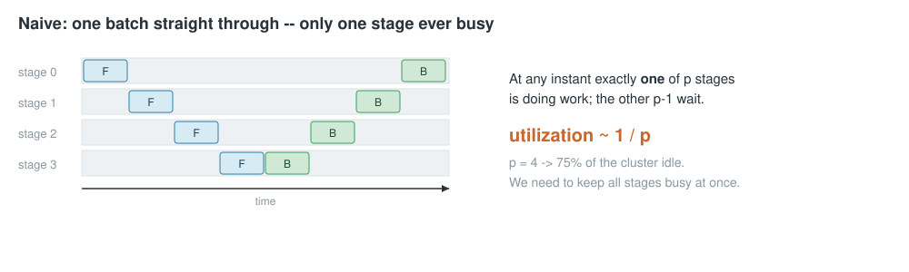
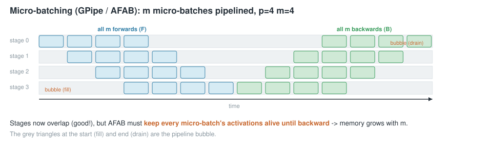
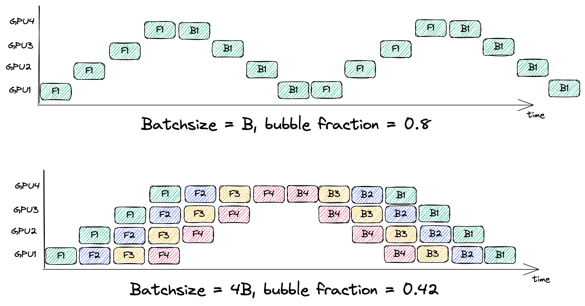
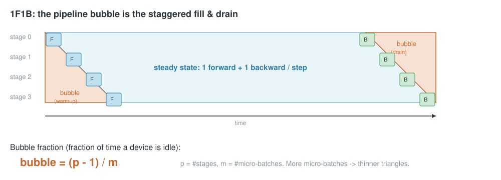
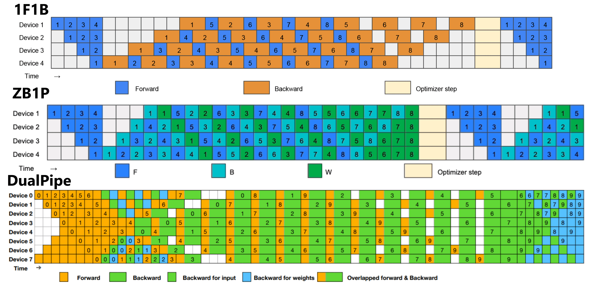

<!-- _class: lead -->

# Pipeline Parallelism, from scratch
## How `picotron`'s pipeline_parallel works — then the last two years of PP research

Why PP → naive pipelining → the bubble → 1F1B → **Zero-Bubble**, **Interleaved 1F1B**, **DualPipe**

<span class="muted">build up from "split the model across devices" to three modern schedules that each attack the `(p-1)/m` bubble</span>
<span class="muted">deep dive: micro-batching · autograd B/W split · virtual stages · bidirectional streams · deadlock-free P2P · bit-exact tests</span>

---

## Why pipeline parallelism?

A large model's parameters + activations + optimizer state don't fit on one device. picotron already
shards along **data (DP)**, **tensor (TP)**, **context (CP)** and **expert (EP)** axes. **Pipeline
parallelism (PP)** adds another: split the model **by depth** — give each device a contiguous block of
layers (a *stage*).

- **TP** splits *within* a layer → needs a fast all-reduce every layer (intra-node, NVLink).
- **PP** splits *across* layers → a device only sends its output activations to the **next** stage.
- That is a single point-to-point hop per stage boundary → cheap, and scales across nodes.

<span class="muted">PP is how you train a model deeper than one node's memory with only neighbor-to-neighbor traffic.</span>

---

## Split the model into stages


Forward: stage `s` computes, sends activations to `s+1`. Backward: stage `s+1` sends input-gradients
back to `s`. Only neighbors talk — that is `pipeline_communicate(send_forward / recv_forward / …)`.

---

## Naive execution wastes p-1 of every p devices

Run one batch straight through the stages: stage 0 works while 1, 2, 3 wait; then stage 1 while the
rest wait; and so on — forward down the stages, backward back up.



At any instant **one** of `p` stages is busy → utilization `~ 1/p`. With `p = 4` we waste 75% of the
cluster. We need all stages busy at once.

---

## Micro-batching = pipelining (GPipe / AFAB)

Split the global batch into `m` **micro-batches** and feed them back-to-back. Now while stage 0 starts
micro-batch 1, stage 1 works on micro-batch 0 — the stages **overlap**.



**AFAB** (all-forward-all-backward) = picotron's `train_step_pipeline_afab`: push all `m` forwards,
then all `m` backwards. Simple — but it keeps **every** micro-batch's activations alive until backward,
so activation memory grows with `m`.

---

## The bubble, quantified

The pipeline still needs `p-1` steps to **fill** and `p-1` to **drain** — the shaded triangles where
some devices idle. Relative to the `m` useful steps:

$$ \text{bubble fraction} \;=\; \frac{\text{idle}}{\text{busy}} \;=\; \frac{p-1}{m} $$



- More micro-batches (`m` ↑) → thinner triangles → smaller bubble (above: `m=1`→0.8, `m=4`→0.42)… but AFAB's activation memory ↑.
- More stages (`p` ↑) → bigger bubble.

<span class="muted">So we want large `m` for throughput — but AFAB makes that expensive in memory. Enter 1F1B. · <span class="muted">fig: siboehm.com</span></span>

---

## 1F1B: same bubble, bounded memory

Reorder so each stage, after a short warmup, does **one forward then one backward** in lockstep. Each
backward frees the activations of the oldest in-flight micro-batch, so a stage holds only `~p`
micro-batches' activations (not `m`).



Same `(p-1)/m` bubble as AFAB, but activation memory is capped by pipeline **depth**, not `m`
(e.g. `m=100`: AFAB holds ~100× activations, 1F1B only ~`p`). This is picotron's default
(`train_step_pipeline_1f1b`) and the foundation everything below builds on.

---

## picotron's two built-in schedules — and our goal

```python
# pipeline_parallel.py
train_step_pipeline_afab   # all forwards, then all backwards — biggest memory + bubble
train_step_pipeline_1f1b   # 1 fwd / 1 bwd steady state — bubble (p-1)/m, bounded memory
```

Each rank holds a `PipelineParallel` stage: `embedding` (first), some `decoder_layers`,
`final_norm` + `final_proj` (last). Communication is point-to-point on a ring.

**Goal:** shrink the `(p-1)/m` bubble. Three levers, three trade-offs:

| schedule | idea | trades |
|---|---|---|
| Zero-Bubble | split backward into B + W | W-queue activation memory (~1× FLOPs) |
| Interleaved 1F1B | `v` virtual stages per rank | `v`× more comm |
| DualPipe | two opposing streams | ~2× parameter memory |

---

## The three levers in one picture



<span class="muted">DeepSeek-V3 (arXiv:2412.19437). **Top — 1F1B:** the `(p-1)/m` baseline. **Middle — ZB1P:** backward split into **B** (input-grad, teal) + **W** (weight-grad, green) → **Lever 1**. **Bottom — DualPipe:** two opposing F/B streams fill each other's bubbles → **Lever 3**. (Interleaved 1F1B / Lever 2 is the orthogonal "`v` chunks per rank" axis.)</span>

---

## Lever 1 — Zero-Bubble (ZB-H1)

<span class="muted">Qi et al., ICLR 2024 — arXiv:2401.10241</span>

A backward fuses **B** (grad w.r.t. *input* — the previous stage needs it, so it's on the critical
path) and **W** (grad w.r.t. *weights* — only needed before `optimizer.step()`, so reschedulable).


---

## ZB: how we split the backward (true ~1× FLOPs)

We split at the **Linear** level, so each matmul runs **once** — not a 2× double-traversal. A custom
autograd function (`_DeferredLinear`) returns the input-grad now and **defers** the weight-grad:

```python
class _DeferredLinear(torch.autograd.Function):
    @staticmethod
    def backward(ctx, grad_y):
        x, weight = ctx.saved_tensors
        grad_x = grad_y.matmul(weight)              # B: needed upstream now (critical path)
        def _accumulate_weight_grad():              # W: queued, drained into the bubble later
            gw = grad_y.reshape(-1, D).t().matmul(x.reshape(-1, D))
            weight.grad = gw if weight.grad is None else weight.grad + gw
        _W_TASKS.append(_accumulate_weight_grad)
        return grad_x, None                         # weight-grad = None for now
```

`backward_input` runs autograd → collects only `grad_x` (+ a FIFO of deferred W-tasks per micro-batch);
`backward_weight` drains that FIFO. The **B** comm pattern is identical to 1F1B → deadlock-free, and
gradients are **bit-exact** (`grad_diff = 0`). Cost: the W queue holds `(x, grad_y)` per in-flight
micro-batch → extra activation memory (peak grows with `num_warmup`, like ZB-H1 in the paper).

---

## Lever 2 — Interleaved 1F1B (virtual pipeline)

<span class="muted">Narayanan et al., Megatron-LM — arXiv:2104.04473</span>

Give each rank `v` **non-contiguous** chunks. With `G = p·v` virtual stages laid out round-robin,
each stage is `v`× smaller, so the fill/drain triangles are `v`× thinner.


---

## Interleaved: the wrapper + the schedule

```python
class InterleavedPipelineParallel(nn.Module):
    # virtual stage g lives on rank g % p, chunk g // p
    self.chunk_global_id = [c * p + rank for c in range(num_virtual_stages)]
    # embeddings / decoder_chunks / final_norms / final_projs are ModuleLists, one per chunk
```

- Per-chunk FIFOs of inputs/outputs/grads; `fwd_chunk(step)` / `bwd_chunk(step)` pick the active chunk.
- One **combined** ring send/recv per step (`interleaved_pipeline_communicate`): post all sends, drain
  receives first, then sends — the deadlock-free pattern for synchronous ring P2P.
- Requires `m % p == 0`.

**Bubble:** `(p-1)/(m·v)`  ·  **cost:** `v`× more cross-rank activation hops.

---

## Lever 3 — DualPipe (bidirectional pipeline)

<span class="muted">DeepSeek-V3 — arXiv:2412.19437</span>

Run **two micro-batch streams in opposite directions**. Each rank holds the two stages symmetric
about the middle (stage `r` and stage `p-1-r`), so a stage is replicated across the pair `(r, p-1-r)`.


---

## DualPipe: two streams overlapped in time (what we built)

```python
# Each stream is a generator yielding its batched P2P at every comm point:
down = _dualpipe_stream(model, batches[:m//2], group=grp_down, ...)  # stage 0→p-1
up   = _dualpipe_stream(model, batches[m//2:], group=grp_up,   ...)  # stage p-1→0 (mirror)
_drive_dualpipe(down, up)      # interleave the two on independent communicators
dualpipe_reduce_grads(model)   # sum each replicated stage's grads across (r, p-1-r)
```

- **Structure** (replicated stages + cross-pair grad sum) reproduces a full `m`-micro-batch gradient
  **bit-exactly** — on gloo **and** NCCL.
- **Time-domain overlap is real:** one stream's forwards fill the other's backward bubbles
  (bubble `≈ (p-1)/(2m)`). NCCL → single-thread completion-polling driver (`is_completed()`), comm of one
  direction overlaps compute of the other on its own CUDA stream; gloo → thread-per-stream on separate
  communicators. Independent PP subgroups keep the two streams' P2P from aliasing.
- **Bit-exact + deadlock-free on NCCL at `p=2/4/8`** (eager P2P-connection warmup + per-stream CUDA
  streams break the lazy-handshake / CUDA-stream-ordering deadlocks).
- **Caveat:** each rank holds **two** stages (`r` and `p-1-r`) → ~2× layer compute. On 8×L4 (`p=8,
  m=16`) it is 0.78× of 1F1B: overlap recovers most of the 2× (it is 1.28×, not 2×) but not all. It pays
  off only where removed bubble > 2× replication tax — very large `p`/small `m`, or with DeepSeek's
  intra-chunk SM-level kernel overlap (the remaining custom-CUDA piece).

---

## Why batched P2P is mandatory

Synchronous ring P2P deadlocks if every rank blocks on a send whose matching receive sits behind the
partner's own send. The fix used by every schedule here: fuse all of a step's sends+recvs into **one**
`batch_isend_irecv` group, which NCCL schedules together (and gloo posts non-blocking):

```python
ops = []
if send_t is not None: ops.append(dist.P2POp(dist.isend, send_t, next_rank))
if recv_buf is not None: ops.append(dist.P2POp(dist.irecv, recv_buf, prev_rank))
for req in dist.batch_isend_irecv(ops):   # one matched group → deadlock-free
    req.wait()
```

Every `send` is count-matched by exactly one `recv` in the schedule → no phantom op, no hang. (Posting
unbatched `isend`/`irecv` made NCCL serialize them as collectives and hang at `p ≥ 8` — hence the batch.)

---

## Correctness: bit-exact gradients vs a full-model reference

`tests/test_pipeline_parallel.py` builds a tiny Llama, takes a **non-pipelined** gradient reference on
the same weights + micro-batches, shards the *same* modules across ranks, runs each schedule, and
compares the gradients this rank owns.

```
torchrun --nproc_per_node 2 tests/test_pipeline_parallel.py   # p=2
torchrun --nproc_per_node 4 tests/test_pipeline_parallel.py   # p=4
```

```
[rank 0] zero_bubble    PASSED  grad_diff = 0.00e+00
[rank 0] interleaved(v=2) PASSED grad_diff = 0.00e+00
[rank 0] dualpipe       PASSED  grad_diff = 2.98e-08   # float accumulation order, < 1e-4
```

ZB / interleaved are **exactly** the reference; DualPipe matches to float-accumulation order.

---

## The bubble, measured


`tests/bench_pp_schedules.py` reports measured step time next to these analytical fractions. On 8× L4
(p=8, bf16, m=16): interleaved wins (1.07×); ZB-H1's true ~1× split ties 1F1B (the per-Linear
W-deferral's Python overhead roughly cancels the bubble-fill on commodity GPUs) while costing extra
activation memory; DualPipe is 0.78× — bit-exact and overlapped, but each rank's 2-stage replication is
~2× compute that the overlap only partly hides. An honest result. On a tiny CPU model the bubble is
invisible (compute dominates).

---

## Recap — three trade-offs against `(p-1)/m`

<div class="cols"><div>

**Zero-Bubble (ZB-H1)**
- split backward → B (critical) + W (fill)
- bubble `≈ 0`, comm unchanged, ~1× FLOPs
- cost: W-queue activation memory

**Interleaved 1F1B**
- `v` virtual stages / rank
- bubble `(p-1)/(m·v)`
- cost: `v`× comm, needs `m % p == 0`

</div><div>

**DualPipe**
- two opposing streams, replicated stages
- bubble `(p-1)/(2m)` (overlapped)
- cost: ~2× param memory

**All three**
- built on picotron's 1F1B engine
- deadlock-free ring P2P
- bit-exact vs full-model reference

</div></div>

<span class="muted">Wired into `create_config.py --pp_engine` / `train.py`: ZB is a drop-in; interleaved/dualpipe run on the test+bench harness (gloo/CPU + NCCL/GPU).</span>

---

<!-- _class: lead -->

# Thanks

`picotron/pipeline_parallel/pp_schedules.py` · `tests/test_pipeline_parallel.py` · `tests/bench_pp_schedules.py`

<span class="muted">Zero-Bubble (Qi 2024) · Interleaved 1F1B (Narayanan 2021) · DualPipe (DeepSeek-V3 2024)</span>
