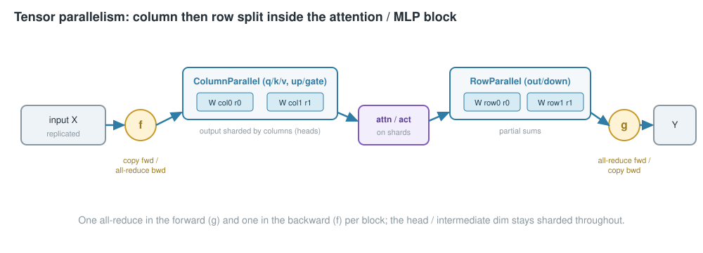
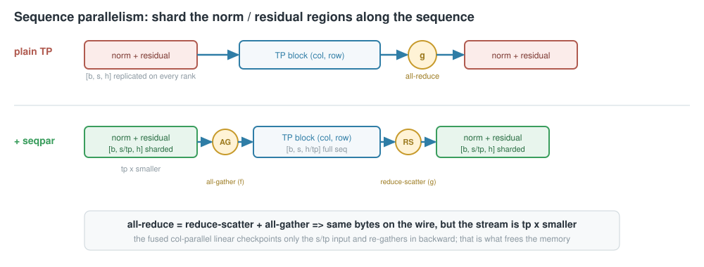
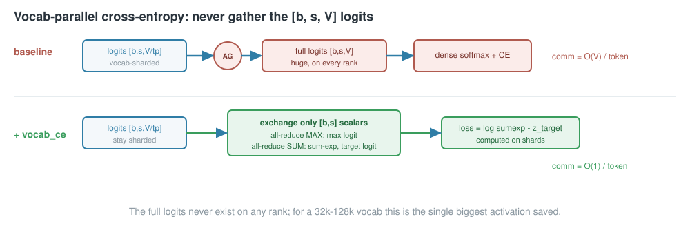

<!-- _class: lead -->

# Tensor Parallelism, from scratch
## What ships in `picotron`, and three improvements I layered on top

Megatron column/row split → **async overlap** · **sequence parallelism** · **vocab-parallel cross-entropy**

<span class="muted">all bit-exact with the baseline, gradient-validated and benchmarked on 2× A100</span>

---

## What we are parallelizing

A transformer block is two GEMM sandwiches: **attention** (`q,k,v → attn → out`) and **MLP**
(`up,gate → act → down`). Tensor parallelism splits those matmuls *inside* the layer across the TP group.

- splits **within** a layer ⇒ a collective **every** layer ⇒ lives on NVLink, TP degree kept small (≤ 8)
- (contrast: pipeline splits **across** layers, one neighbor hop per stage boundary)

<span class="muted">Megatron-LM, Shoeybi et al. 2019 — [arXiv:1909.08053](https://arxiv.org/abs/1909.08053)</span>

---

## The column → row split



- **Column-parallel** (`q/k/v, up/gate`): shard by output columns. Input replicated, output sharded.
- **Row-parallel** (`out, down`): shard by input rows. Input already sharded, output is a partial sum.

Chaining col→row ⇒ **one all-reduce in fwd, one in bwd** per block; heads/intermediate stay sharded.

---

## The `f` and `g` operators

Two conjugate autograd functions — that's the whole communication contract.

```python
class CopyToModelParallelRegion(Function):     # f: column-parallel input
    def forward(ctx, x):  return x                       # copy
    def backward(ctx, g): all_reduce(g); return g        # all-reduce

class ReduceFromModelParallelRegion(Function): # g: row-parallel output
    def forward(ctx, x):  all_reduce(x); return x        # all-reduce
    def backward(ctx, g): return g                       # copy
```

The embedding is sharded over the **vocabulary** (`VocabParallelEmbedding`): mask off-shard tokens,
look up, all-reduce. This is the correct Megatron-v1 TP that already ships in picotron.

---

## Three improvements, one ladder

Each is **opt-in** (defaults unchanged) and **bit-exact** with the baseline.

| rung | does | buys |
| --- | --- | --- |
| **+async** | overlap col-parallel input-grad all-reduce with the weight-grad GEMM | hide comm |
| **+seqpar** | shard norm / residual along the **sequence** | `tp×` less activation memory, *same bytes* |
| **+vocab_ce** | keep logits vocab-sharded; loss sends `[b,s]` scalars | no `[b,s,V]` logits, O(V)→O(1) comm |

```python
apply_tensor_parallel(model, async_tp=True, sequence_parallel=True, vocab_parallel_ce=True)
```

---

## Rung 1 — async communication overlap

The column-parallel backward owes the previous layer `grad_x = grad_y · W` (all-reduced) **and** the
local weight grad. Launch the `grad_x` all-reduce **first**, compute `grad_W` while it flies:

```python
grad_input = grad_output @ weight
handle = dist.all_reduce(grad_input, async_op=True)   # launch, don't wait
grad_weight = grad_output.t() @ input_                # overlaps the collective
handle.wait()
```

- The code existed but was never wired in — `async_tp=True` turns it on.
- Needs **`CUDA_DEVICE_MAX_CONNECTIONS=1`** so the collective and GEMM actually run concurrently.

---

## Rung 2 — sequence parallelism

Between blocks (norm + residual) activations are **replicated** → that memory ignores TP. Shard them
along the **sequence** instead:



The identity that makes it free on bytes: **all-reduce = reduce-scatter + all-gather.**

---

## Rung 2 — the subtlety that decides the win

A naive `all_gather` + `F.linear` **loses** the memory win: autograd saves the *gathered* full-sequence
input for the weight-grad, so the biggest activation is still full-size on every rank.

**Fix (Megatron):** a fused gather+linear that checkpoints only the **sharded** input and re-gathers in
backward.

```python
class _ColumnParallelLinearWithSequenceParallel(Function):
    def forward(ctx, x_sharded, w, b):
        ctx.save_for_backward(x_sharded, w)          # NOT the gathered tensor
        return all_gather_seq(x_sharded) @ w.t() + b
    def backward(ctx, g):
        x_full = all_gather_seq(x_sharded)           # recompute, don't store
        ...                                          # reduce-scatter grad_x; grad_w from x_full
```

> This one change turned the measured SP saving from **51 MB → 3.3 GB**.

<span class="muted">cost: each rank's RMSNorm sees a different seq shard ⇒ all-reduce its weight grad over TP (a "sequence-parallel" param).</span>

---

## Rung 3 — vocab-parallel cross-entropy

The output projection is already column-parallel over the vocab. The stock path all-gathers the full
`[b,s,V]` logits and runs a dense softmax on every rank — the biggest activation in the step.



Keep logits sharded; exchange only per-token **max**, **Σexp**, **target logit**. `O(V) → O(1)` comm,
full logits never materialized. Backward is the saved-softmax `softmax − onehot(target)`.

---

## Bit-exact — every rung

```bash
# full Llama: plain TP and TP+sequence-parallel vs a single-GPU reference
torchrun --nproc_per_node 2 tests/test_tp_sequence_parallel.py
# vocab-parallel CE vs dense F.cross_entropy on gathered logits
torchrun --nproc_per_node 2 tests/test_tp_vocab_ce.py
```

| check | result |
| --- | --- |
| plain TP vs single-GPU reference | `loss_diff = 0`, `grad_diff ≈ 2e-8` |
| TP + sequence parallel vs reference | `loss_diff = 0`, `grad_diff ≈ 2e-8` |
| vocab-parallel CE vs dense CE | `grad_diff ≈ 4e-9` |

The sequence-parallel test also all-reduces the norm weight grads over TP — exactly what real training must do.

---

## The ablation (2× A100, TP=2, bf16)

24-layer · hidden 2048 · seq 2048 · mbs 4 · SDPA (`tests/bench_tp.py`):

| config | ms/step | tok/s | peak MB | mem vs base | speedup |
| --- | ---: | ---: | ---: | ---: | ---: |
| baseline | 327.7 | 49992 | 17865 | 1.00× | 1.00× |
| +async | 320.5 | 51126 | 17865 | 1.00× | **1.02×** |
| +seqpar | 363.2 | 45107 | **14576** | **1.23×** | 0.90× |
| +vocab_ce | 321.7 | 50936 | 15986 | 1.12× | 1.02× |
| **+seqpar+vocab_ce** | 356.4 | 45966 | **12697** | **1.41×** | 0.92× |

<span class="muted">2nd shape (L16/h3072/seq4096/vocab49k): seqpar 1.17× · vocab_ce 1.14× · both **1.37×** — same story.</span>

---

## The honest lesson

<div class="cols">
<div>

### Sequence parallelism
A **memory** lever, not a speed one. 1.23× less memory by sharding the residual stream; the extra
reduce-scatter / all-gather *calls* cost ~10% on a single NVLink node at TP=2. Pays off more at higher
TP / across nodes (and unlocks not recomputing those regions).

</div>
<div>

### Vocab-parallel CE
**Nearly free** — 1.12–1.14× memory at neutral speed. Kills the `[b,s,V]` gather + dense softmax for a
few `[b,s]` all-reduces; helps more as the vocab grows.

### Async overlap
Small win here (1.02×); grows with the weight-grad GEMM vs all-reduce latency.

</div>
</div>

<br>

**They stack: 1.41× less memory** → a longer sequence or bigger micro-batch on the same card.

---

## Decision guide

| Your situation | Turn on |
| --- | --- |
| Always (it's nearly free, big vocab) | **`vocab_parallel_ce=True`** |
| Tight on activation memory / want longer seq | **`sequence_parallel=True`** |
| Large hidden, comm-latency visible, single connection | **`async_tp=True`** + `CUDA_DEVICE_MAX_CONNECTIONS=1` |
| Memory-bound at scale (high TP, cross-node) | **seqpar + vocab_ce** together |

```python
apply_tensor_parallel(model, async_tp=False, sequence_parallel=True, vocab_parallel_ce=True)
```

---

<!-- _class: lead -->

# Appendix
## file map · how to run

---

## File map & how to run

| File | Role |
| --- | --- |
| `tensor_parallel.py` | `ColumnParallelLinear`, `RowParallelLinear`, `VocabParallelEmbedding`, `apply_tensor_parallel` |
| `tp_communications.py` | `f`/`g` collectives, async-overlap linear, `vocab_parallel_cross_entropy` |
| `../sequence_parallel/` | seq-parallel collectives + fused gather-linear (shares the TP group) |
| `tests/test_tensor_parallel.py` | column/row vs reference `nn.Linear` |
| `tests/test_tp_sequence_parallel.py` | plain TP & TP+SP vs single-GPU reference (bit-exact) |
| `tests/test_tp_vocab_ce.py` | vocab-parallel CE vs dense cross-entropy |
| `tests/bench_tp.py` | the ablation: step time / tokens/s / peak memory per rung |

```bash
CUDA_DEVICE_MAX_CONNECTIONS=1 torchrun --nproc_per_node 2 tests/test_tp_sequence_parallel.py
CUDA_DEVICE_MAX_CONNECTIONS=1 torchrun --nproc_per_node 2 tests/bench_tp.py \
    --hidden 2048 --inter 5632 --layers 24 --vocab 32768 --seq 2048 --mbs 4
```
